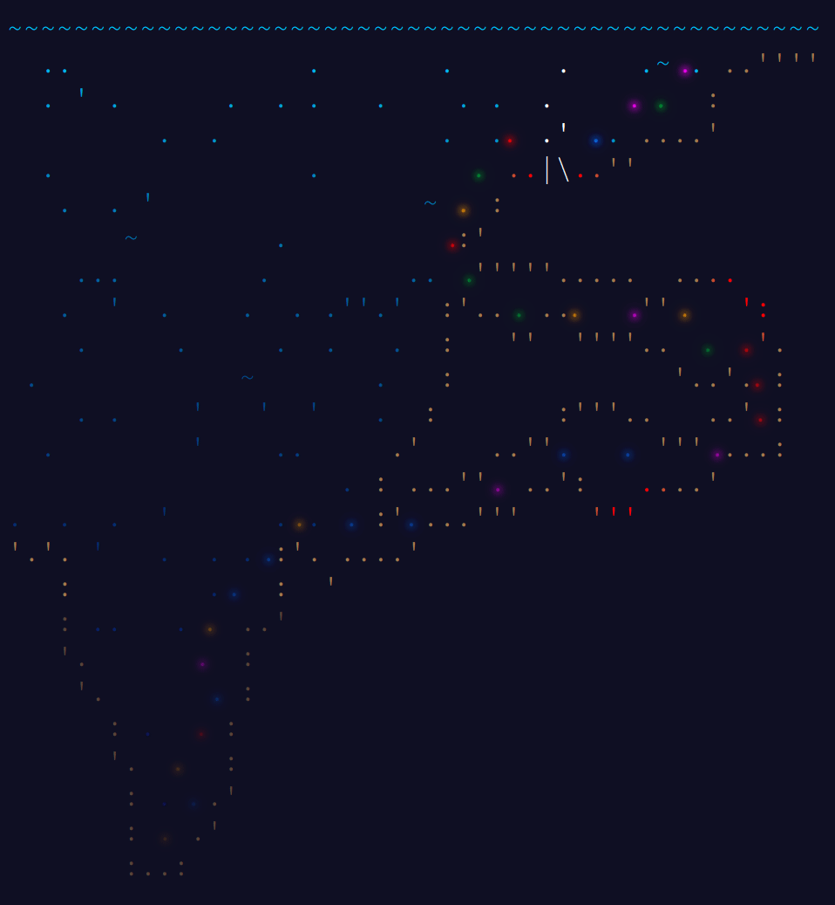

# 🎄 Advent of Code 🎄

[Advent of Code](https://adventofcode.com)

## 2022

|                      Day                       |          Name           |     Stars     | Notes     |
| :--------------------------------------------: | :---------------------: | :-----------: | --------- |
|  [Day 1](https://adventofcode.com/2022/day/1)  |    Calorie Counting     | :star: :star: |           |
|  [Day 2](https://adventofcode.com/2022/day/2)  |   Rock Paper Scissors   | :star: :star: |           |
|  [Day 3](https://adventofcode.com/2022/day/3)  | Rucksack Reorganization | :star: :star: |           |
|  [Day 4](https://adventofcode.com/2022/day/4)  |      Camp Cleanup       | :star: :star: |           |
|  [Day 5](https://adventofcode.com/2022/day/5)  |      Supply Stacks      | :star: :star: |           |
|  [Day 6](https://adventofcode.com/2022/day/6)  |     Tuning Trouble      | :star: :star: |           |
|  [Day 7](https://adventofcode.com/2022/day/7)  | No Space Left On Device | :star: :star: |           |
|  [Day 8](https://adventofcode.com/2022/day/8)  |   Treetop Tree House    | :star: :star: |           |
|  [Day 9](https://adventofcode.com/2022/day/9)  |       Rope Bridge       | :star: :star: |           |
| [Day 10](https://adventofcode.com/2022/day/10) |    Cathode-Ray Tube     | :star: :star: |           |
| [Day 11](https://adventofcode.com/2022/day/11) |  Monkey in the Middle   | :star: :star: | Input     |
| [Day 12](https://adventofcode.com/2022/day/12) | Hill Climbing Algorithm | :star: :star: | Grid, BFS |
| [Day 13](https://adventofcode.com/2022/day/13) |     Distress Signal     | :star: :star: |           |
| [Day 14](https://adventofcode.com/2022/day/14) |   Regolith Reservoir    | :star: :star: |           |
| [Day 15](https://adventofcode.com/2022/day/15) |  Beacon Exclusion Zone  | :star: :star: |           |
| [Day 16](https://adventofcode.com/2022/day/16) |  Proboscidea Volcanium  | :star: :star: |           |
| [Day 17](https://adventofcode.com/2022/day/17) |    Pyroclastic Flow     | :star: :star: |           |
| [Day 18](https://adventofcode.com/2022/day/18) |    Boiling Boulders     | :star: :star: |           |
| [Day 19](https://adventofcode.com/2022/day/19) |                         |               |           |
| [Day 20](https://adventofcode.com/2022/day/20) |                         |               |           |
| [Day 21](https://adventofcode.com/2022/day/21) |                         |               |           |
| [Day 22](https://adventofcode.com/2022/day/22) |                         |               |           |
| [Day 23](https://adventofcode.com/2022/day/23) |                         |               |           |
| [Day 24](https://adventofcode.com/2022/day/24) |                         |               |           |
| [Day 25](https://adventofcode.com/2022/day/25) |                         |               |           |

## 2021

|                      Day                       |          Name           |     Stars     | Notes                                             |
| :--------------------------------------------: | :---------------------: | :-----------: | ------------------------------------------------- |
|  [Day 1](https://adventofcode.com/2021/day/1)  |       Sonar Sweep       | :star: :star: | Math                                              |
|  [Day 2](https://adventofcode.com/2021/day/2)  |          Dive!          | :star: :star: | Math                                              |
|  [Day 3](https://adventofcode.com/2021/day/3)  |    Binary Diagnostic    | :star: :star: | Bitwise                                           |
|  [Day 4](https://adventofcode.com/2021/day/4)  |       Giant Squid       | :star: :star: | Grid Sim                                          |
|  [Day 5](https://adventofcode.com/2021/day/5)  |  Hydrothermal Venture   | :star: :star: | Grid                                              |
|  [Day 6](https://adventofcode.com/2021/day/6)  |       Lanternfish       | :star: :star: | DynProg Scaling                                   |
|  [Day 7](https://adventofcode.com/2021/day/7)  | The Treachery of Whales | :star: :star: | Math Optimize                                     |
|  [Day 8](https://adventofcode.com/2021/day/8)  |  Seven Segment Search   | :star: :star: | Logic                                             |
|  [Day 9](https://adventofcode.com/2021/day/9)  |       Smoke Basin       | :star: :star: | ImgProcess BFS                                    |
| [Day 10](https://adventofcode.com/2021/day/10) |     Syntax Scoring      | :star: :star: | Grammar                                           |
| [Day 11](https://adventofcode.com/2021/day/11) |      Dumbo Octopus      | :star: :star: | CellAuto                                          |
| [Day 12](https://adventofcode.com/2021/day/12) |     Passage Pathing     | :star: :star: | Graph DFS                                         |
| [Day 13](https://adventofcode.com/2021/day/13) |   Transparent Origami   | :star: :star: | Spatial                                           |
| [Day 14](https://adventofcode.com/2021/day/14) | Extended Polymerization | :star: :star: | Grammar DynProg Scaling                           |
| [Day 15](https://adventofcode.com/2021/day/15) |         Chiton          | :star: :star: | PathFind                                          |
| [Day 16](https://adventofcode.com/2021/day/16) |     Packet Decoder      | :star: :star: | Grammar Bitwise                                   |
| [Day 17](https://adventofcode.com/2021/day/17) |       Trick Shot        | :star: :star: | Optimize                                          |
| [Day 18](https://adventofcode.com/2021/day/18) |        Snailfish        | :star: :star: | Grammar Optimize                                  |
| [Day 19](https://adventofcode.com/2021/day/19) |     Beacon Scanner      | :star: :star: | Spatial BFS Optimize                              |
| [Day 20](https://adventofcode.com/2021/day/20) |       Trench Map        | :star: :star: | CellAuto                                          |
| [Day 21](https://adventofcode.com/2021/day/21) |       Dirac Dice        | :star: :star: | Math DynProg                                      |
| [Day 22](https://adventofcode.com/2021/day/22) |     Reactor Reboot      | :star: :star: | Spatial DynProg Scaling                           |
| [Day 23](https://adventofcode.com/2021/day/23) |        Amphipod         | :star: :star: | Grid BFS Optimize Logic                           |
| [Day 24](https://adventofcode.com/2021/day/24) |  Arithmetic Logic Unit  | :star: :star: | DFS Memoization Optimize Logic VirtualMach RevEng |
| [Day 25](https://adventofcode.com/2021/day/25) |      Sea Cucumber       | :star: :star: | CellAuto                                          |

## 2020

|                      Day                       |          Name           |     Stars     | Notes                          |
| :--------------------------------------------: | :---------------------: | :-----------: | ------------------------------ |
|  [Day 1](https://adventofcode.com/2020/day/1)  |      Report Repair      | :star: :star: | Math                           |
|  [Day 2](https://adventofcode.com/2020/day/2)  |   Password Philosophy   |               | Strings                        |
|  [Day 3](https://adventofcode.com/2020/day/3)  |   Toboggan Trajectory   |               | Grid                           |
|  [Day 4](https://adventofcode.com/2020/day/4)  |   Passport Processing   |               | Grammar Input                  |
|  [Day 5](https://adventofcode.com/2020/day/5)  |     Binary Boarding     |               | Bitwise                        |
|  [Day 6](https://adventofcode.com/2020/day/6)  |     Custom Customs      |               | Logic Input                    |
|  [Day 7](https://adventofcode.com/2020/day/7)  |    Handy Haversacks     |               | Graph BFS DFS DynProg Input    |
|  [Day 8](https://adventofcode.com/2020/day/8)  |    Handheld Halting     |               | Memoization VirtualMach RevEng |
|  [Day 9](https://adventofcode.com/2020/day/9)  |     Encoding Error      |               | Math                           |
| [Day 10](https://adventofcode.com/2020/day/10) |      Adapter Array      |               | DynProg                        |
| [Day 11](https://adventofcode.com/2020/day/11) |     Seating System      |               | CellAuto Grid Memoization      |
| [Day 12](https://adventofcode.com/2020/day/12) |        Rain Risk        |               | Spatial Grid                   |
| [Day 13](https://adventofcode.com/2020/day/13) |     Shuttle Search      |               | Math Optimize                  |
| [Day 14](https://adventofcode.com/2020/day/14) |      Docking Data       |               | Bitwise                        |
| [Day 15](https://adventofcode.com/2020/day/15) | Rambunctious Recitation |               | Memoization Sim                |
| [Day 16](https://adventofcode.com/2020/day/16) |   Ticket Translation    |               | Logic Input                    |
| [Day 17](https://adventofcode.com/2020/day/17) |      Conway Cubes       |               | CellAuto                       |
| [Day 18](https://adventofcode.com/2020/day/18) |     Operation Order     |               | Grammar                        |
| [Day 19](https://adventofcode.com/2020/day/19) |    Monster Messages     |               | Grammar                        |
| [Day 20](https://adventofcode.com/2020/day/20) |     Jurassic Jigsaw     |               | ImgProcess                     |
| [Day 21](https://adventofcode.com/2020/day/21) |   Allergen Assessment   |               | Logic                          |
| [Day 22](https://adventofcode.com/2020/day/22) |       Crab Combat       |               | Memoization Sim                |
| [Day 23](https://adventofcode.com/2020/day/23) |        Crab Cups        |               | Sim Scaling                    |
| [Day 24](https://adventofcode.com/2020/day/24) |      Lobby Layout       |               | Grammar CellAuto Grid          |
| [Day 25](https://adventofcode.com/2020/day/25) |      Combo Breaker      |               | Math                           |

## 2019

|                      Day                       |                Name                | Stars | Notes                               |
| :--------------------------------------------: | :--------------------------------: | :---: | ----------------------------------- |
|  [Day 1](https://adventofcode.com/2019/day/1)  | The Tyranny of the Rocket Equation |       | Math                                |
|  [Day 2](https://adventofcode.com/2019/day/2)  |         1202 Program Alarm         |       | VirtualMach                         |
|  [Day 3](https://adventofcode.com/2019/day/3)  |           Crossed Wires            |       | Grid Memoization Optimize           |
|  [Day 4](https://adventofcode.com/2019/day/4)  |          Secure Container          |       | Strings                             |
|  [Day 5](https://adventofcode.com/2019/day/5)  |  Sunny with a Chance of Asteroids  |       | VirtualMach                         |
|  [Day 6](https://adventofcode.com/2019/day/6)  |        Universal Orbit Map         |       | Graph BFS                           |
|  [Day 7](https://adventofcode.com/2019/day/7)  |       Amplification Circuit        |       | Math Optimize VirtualMach           |
|  [Day 8](https://adventofcode.com/2019/day/8)  |         Space Image Format         |       | Grid                                |
|  [Day 9](https://adventofcode.com/2019/day/9)  |            Sensor Boost            |       | VirtualMach                         |
| [Day 10](https://adventofcode.com/2019/day/10) |         Monitoring Station         |       | Math Grid Optimize                  |
| [Day 11](https://adventofcode.com/2019/day/11) |            Space Police            |       | Grid                                |
| [Day 12](https://adventofcode.com/2019/day/12) |         The N-Body Problem         |       | Math Spatial Memoization Scaling    |
| [Day 13](https://adventofcode.com/2019/day/13) |            Care Package            |       | Grid Sim                            |
| [Day 14](https://adventofcode.com/2019/day/14) |        Space Stoichiometry         |       | Optimize Logic                      |
| [Day 15](https://adventofcode.com/2019/day/15) |           Oxygen System            |       | Grid BFS DFS                        |
| [Day 16](https://adventofcode.com/2019/day/16) |   Flawed Frequency Transmission    |       | Math Scaling                        |
| [Day 17](https://adventofcode.com/2019/day/17) |           Set and Forget           |       | Strings ImgProcess Grid             |
| [Day 18](https://adventofcode.com/2019/day/18) |     Many-Worlds Interpretation     |       | Grid PathFind BFS Memoization Logic |
| [Day 19](https://adventofcode.com/2019/day/19) |            Tractor Beam            |       | ImgProcess Optimize                 |
| [Day 20](https://adventofcode.com/2019/day/20) |             Donut Maze             |       | Grid PathFind BFS                   |
| [Day 21](https://adventofcode.com/2019/day/21) |       Springdroid Adventure        |       | Bitwise                             |
| [Day 22](https://adventofcode.com/2019/day/22) |            Slam Shuffle            |       | Math Scaling                        |
| [Day 23](https://adventofcode.com/2019/day/23) |            Category Six            |       | Sim                                 |
| [Day 24](https://adventofcode.com/2019/day/24) |         Planet of Discord          |       | CellAuto Memoization                |
| [Day 25](https://adventofcode.com/2019/day/25) |             Cryostasis             |       | Sim                                 |

## 2018

|                      Day                       |                 Name                 | Stars | Notes                             |
| :--------------------------------------------: | :----------------------------------: | :---: | --------------------------------- |
|  [Day 1](https://adventofcode.com/2018/day/1)  |         Chronal Calibration          |       | Math Memoization                  |
|  [Day 2](https://adventofcode.com/2018/day/2)  |     Inventory Management System      |       | Strings                           |
|  [Day 3](https://adventofcode.com/2018/day/3)  |      No Matter How You Slice It      |       | Grid                              |
|  [Day 4](https://adventofcode.com/2018/day/4)  |            Repose Record             |       | Optimize                          |
|  [Day 5](https://adventofcode.com/2018/day/5)  |         Alchemical Reduction         |       | Grammar Optimize                  |
|  [Day 6](https://adventofcode.com/2018/day/6)  |         Chronal Coordinates          |       | ImgProcess                        |
|  [Day 7](https://adventofcode.com/2018/day/7)  |         The Sum of Its Parts         |       | Graph                             |
|  [Day 8](https://adventofcode.com/2018/day/8)  |           Memory Maneuver            |       | Grammar                           |
|  [Day 9](https://adventofcode.com/2018/day/9)  |             Marble Mania             |       | Sim Scaling                       |
| [Day 10](https://adventofcode.com/2018/day/10) |           The Stars Align            |       | Spatial Optimize                  |
| [Day 11](https://adventofcode.com/2018/day/11) |            Chronal Charge            |       | ImgProcess DynProg Optimize       |
| [Day 12](https://adventofcode.com/2018/day/12) |     Subterranean Sustainability      |       | CellAuto Memoization Scaling      |
| [Day 13](https://adventofcode.com/2018/day/13) |          Mine Cart Madness           |       | Grid Sim                          |
| [Day 14](https://adventofcode.com/2018/day/14) |           Chocolate Charts           |       | Strings Sim                       |
| [Day 15](https://adventofcode.com/2018/day/15) |           Beverage Bandits           |       | Grid PathFind Optimize Sim        |
| [Day 16](https://adventofcode.com/2018/day/16) |        Chronal Classification        |       | Logic Bitwise VirtualMach         |
| [Day 17](https://adventofcode.com/2018/day/17) |          Reservoir Research          |       | CellAuto Grid                     |
| [Day 18](https://adventofcode.com/2018/day/18) |      Settlers of The North Pole      |       | Math CellAuto Memoization Scaling |
| [Day 19](https://adventofcode.com/2018/day/19) |           Go With The Flow           |       | Math VirtualMach RevEng Scaling   |
| [Day 20](https://adventofcode.com/2018/day/20) |            A Regular Map             |       | Grammar Grid Graph PathFind BFS   |
| [Day 21](https://adventofcode.com/2018/day/21) |          Chronal Conversion          |       | Memoization Optimize RevEng       |
| [Day 22](https://adventofcode.com/2018/day/22) |              Mode Maze               |       | Math BFS Optimize Logic           |
| [Day 23](https://adventofcode.com/2018/day/23) | Experimental Emergency Teleportation |       | Spatial Optimize Scaling          |
| [Day 24](https://adventofcode.com/2018/day/24) |     Immune System Simulator 20XX     |       | Optimize Sim Input                |
| [Day 25](https://adventofcode.com/2018/day/25) |      Four-Dimensional Adventure      |       | Spatial BFS                       |

## 2017

|                      Day                       |                  Name                   | Stars | Notes                        |
| :--------------------------------------------: | :-------------------------------------: | :---: | ---------------------------- |
|  [Day 1](https://adventofcode.com/2017/day/1)  |             Inverse Captcha             |       | Strings                      |
|  [Day 2](https://adventofcode.com/2017/day/2)  |           Corruption Checksum           |       | Math                         |
|  [Day 3](https://adventofcode.com/2017/day/3)  |              Spiral Memory              |       | Grid                         |
|  [Day 4](https://adventofcode.com/2017/day/4)  |        High-Entropy Passphrases         |       | Strings                      |
|  [Day 5](https://adventofcode.com/2017/day/5)  | A Maze of Twisty Trampolines, All Alike |       | VirtualMach                  |
|  [Day 6](https://adventofcode.com/2017/day/6)  |           Memory Reallocation           |       | Memoization                  |
|  [Day 7](https://adventofcode.com/2017/day/7)  |            Recursive Circus             |       | Graph DFS                    |
|  [Day 8](https://adventofcode.com/2017/day/8)  |       I Heard You Like Registers        |       | VirtualMach                  |
|  [Day 9](https://adventofcode.com/2017/day/9)  |            Stream Processing            |       | Grammar                      |
| [Day 10](https://adventofcode.com/2017/day/10) |                Knot Hash                |       | Strings Bitwise Sim          |
| [Day 11](https://adventofcode.com/2017/day/11) |                 Hex Ed                  |       | Grid                         |
| [Day 12](https://adventofcode.com/2017/day/12) |             Digital Plumber             |       | Graph BFS                    |
| [Day 13](https://adventofcode.com/2017/day/13) |             Packet Scanners             |       | Math Optimize                |
| [Day 14](https://adventofcode.com/2017/day/14) |          Disk Defragmentation           |       | Grid BFS Bitwise             |
| [Day 15](https://adventofcode.com/2017/day/15) |           Dueling Generators            |       | Math                         |
| [Day 16](https://adventofcode.com/2017/day/16) |          Permutation Promenade          |       | Math Memoization Sim Scaling |
| [Day 17](https://adventofcode.com/2017/day/17) |                Spinlock                 |       | Math Scaling                 |
| [Day 18](https://adventofcode.com/2017/day/18) |                  Duet                   |       | VirtualMach                  |
| [Day 19](https://adventofcode.com/2017/day/19) |            A Series of Tubes            |       | Grid                         |
| [Day 20](https://adventofcode.com/2017/day/20) |             Particle Swarm              |       | Spatial Optimize             |
| [Day 21](https://adventofcode.com/2017/day/21) |               Fractal Art               |       | CellAuto                     |
| [Day 22](https://adventofcode.com/2017/day/22) |             Sporifica Virus             |       | CellAuto                     |
| [Day 23](https://adventofcode.com/2017/day/23) |        Coprocessor Conflagration        |       | VirtualMach RevEng           |
| [Day 24](https://adventofcode.com/2017/day/24) |          Electromagnetic Moat           |       | DFS Optimize                 |
| [Day 25](https://adventofcode.com/2017/day/25) |           The Halting Problem           |       | VirtualMach Input            |

## 2016

|                      Day                       |                  Name                  | Stars | Notes                              |
| :--------------------------------------------: | :------------------------------------: | :---: | ---------------------------------- |
|  [Day 1](https://adventofcode.com/2016/day/1)  |         No Time for a Taxicab          |       | Grid                               |
|  [Day 2](https://adventofcode.com/2016/day/2)  |           Bathroom Security            |       | Grid                               |
|  [Day 3](https://adventofcode.com/2016/day/3)  |        Squares With Three Sides        |       | Math                               |
|  [Day 4](https://adventofcode.com/2016/day/4)  |       Security Through Obscurity       |       | Grammar Strings Math               |
|  [Day 5](https://adventofcode.com/2016/day/5)  |    How About a Nice Game of Chess?     |       | Strings                            |
|  [Day 6](https://adventofcode.com/2016/day/6)  |           Signals and Noise            |       | Strings                            |
|  [Day 7](https://adventofcode.com/2016/day/7)  |      Internet Protocol Version 7       |       | Grammar                            |
|  [Day 8](https://adventofcode.com/2016/day/8)  |       Two-Factor Authentication        |       | Grid                               |
|  [Day 9](https://adventofcode.com/2016/day/9)  |        Explosives in Cyberspace        |       | Strings Scaling                    |
| [Day 10](https://adventofcode.com/2016/day/10) |              Balance Bots              |       | Logic                              |
| [Day 11](https://adventofcode.com/2016/day/11) | Radioisotope Thermoelectric Generators |       | BFS Optimize Logic Input           |
| [Day 12](https://adventofcode.com/2016/day/12) |          Leonardo's Monorail           |       | VirtualMach                        |
| [Day 13](https://adventofcode.com/2016/day/13) |    A Maze of Twisty Little Cubicles    |       | Grid PathFind BFS Bitwise          |
| [Day 14](https://adventofcode.com/2016/day/14) |              One-Time Pad              |       | Strings Scaling                    |
| [Day 15](https://adventofcode.com/2016/day/15) |          Timing is Everything          |       | Math                               |
| [Day 16](https://adventofcode.com/2016/day/16) |            Dragon Checksum             |       | Grammar                            |
| [Day 17](https://adventofcode.com/2016/day/17) |           Two Steps Forward            |       | Strings Grid BFS                   |
| [Day 18](https://adventofcode.com/2016/day/18) |              Like a Rogue              |       | CellAuto                           |
| [Day 19](https://adventofcode.com/2016/day/19) |        An Elephant Named Joseph        |       | Sim                                |
| [Day 20](https://adventofcode.com/2016/day/20) |             Firewall Rules             |       | Optimize Logic                     |
| [Day 21](https://adventofcode.com/2016/day/21) |       Scrambled Letters and Hash       |       | VirtualMach                        |
| [Day 22](https://adventofcode.com/2016/day/22) |             Grid Computing             |       | Grid PathFind Input                |
| [Day 23](https://adventofcode.com/2016/day/23) |             Safe Cracking              |       | VirtualMach RevEng                 |
| [Day 24](https://adventofcode.com/2016/day/24) |          Air Duct Spelunking           |       | Grid PathFind Memoization Optimize |
| [Day 25](https://adventofcode.com/2016/day/25) |              Clock Signal              |       | Optimize VirtualMach               |

## 2015

|                      Day                       |                  Name                  | Stars | Notes          |
| :--------------------------------------------: | :------------------------------------: | :---: | -------------- |
|  [Day 1](https://adventofcode.com/2015/day/1)  |             Not Quite Lisp             |       | Strings        |
|  [Day 2](https://adventofcode.com/2015/day/2)  |   I Was Told There Would Be No Math    |       | Math           |
|  [Day 3](https://adventofcode.com/2015/day/3)  | Perfectly Spherical Houses in a Vacuum |       | Grid           |
|  [Day 4](https://adventofcode.com/2015/day/4)  |       The Ideal Stocking Stuffer       |       | Strings        |
|  [Day 5](https://adventofcode.com/2015/day/5)  | Doesn't He Have Intern-Elves For This? |       | Grammar        |
|  [Day 6](https://adventofcode.com/2015/day/6)  |         Probably a Fire Hazard         |       | Grid           |
|  [Day 7](https://adventofcode.com/2015/day/7)  |         Some Assembly Required         |       | Logic Bitwise  |
|  [Day 8](https://adventofcode.com/2015/day/8)  |              Matchsticks               |       | Grammar        |
|  [Day 9](https://adventofcode.com/2015/day/9)  |         All in a Single Night          |       | Graph DFS      |
| [Day 10](https://adventofcode.com/2015/day/10) |         Elves Look, Elves Say          |       | Strings        |
| [Day 11](https://adventofcode.com/2015/day/11) |            Corporate Policy            |       | Grammar        |
| [Day 12](https://adventofcode.com/2015/day/12) |          JSAbacusFramework.io          |       | Grammar        |
| [Day 13](https://adventofcode.com/2015/day/13) |      Knights of the Dinner Table       |       | Graph Optimize |
| [Day 14](https://adventofcode.com/2015/day/14) |           Reindeer Olympics            |       | Sim            |
| [Day 15](https://adventofcode.com/2015/day/15) |       Science for Hungry People        |       | Math Optimize  |
| [Day 16](https://adventofcode.com/2015/day/16) |                Aunt Sue                |       | Logic          |
| [Day 17](https://adventofcode.com/2015/day/17) |       No Such Thing as Too Much        |       | Optimize       |
| [Day 18](https://adventofcode.com/2015/day/18) |        Like a GIF For Your Yard        |       | CellAuto       |
| [Day 19](https://adventofcode.com/2015/day/19) |          Medicine for Rudolph          |       | Grammar BFS    |
| [Day 20](https://adventofcode.com/2015/day/20) |   Infinite Elves and Infinite Houses   |       | Math Optimize  |
| [Day 21](https://adventofcode.com/2015/day/21) |           RPG Simulator 20XX           |       | Optimize Sim   |
| [Day 22](https://adventofcode.com/2015/day/22) |         Wizard Simulator 20XX          |       | Optimize Sim   |
| [Day 23](https://adventofcode.com/2015/day/23) |        Opening the Turing Lock         |       | VirtualMach    |
| [Day 24](https://adventofcode.com/2015/day/24) |        It Hangs in the Balance         |       | BFS Optimize   |
| [Day 25](https://adventofcode.com/2015/day/25) |              Let It Snow               |       | Grid           |

## Types

[from](https://www.reddit.com/r/adventofcode/comments/z0vmy0/350_stars_a_categorization_and_megaguide/)

### Grammar (Grammar)

- [parsing](https://en.wikipedia.org/wiki/Parsing#Computer_languages)
- [regular expressions](https://en.wikipedia.org/wiki/Regular_expression)
- [pattern matching](https://en.wikipedia.org/wiki/Pattern_matching)
- [symbolic manipulation](https://en.wikipedia.org/wiki/Computer_algebra)
- [term rewriting](https://en.wikipedia.org/wiki/Rewriting)

### Strings (Strings)

- [string Processing](https://en.wikipedia.org/wiki/String_(computer_science#String_processing_algorithms)
- scanning
- [hashes](https://en.wikipedia.org/wiki/Hash_function)
- [compression](https://en.wikipedia.org/wiki/Lossless_data_compression)

### Math (Math)

- [number theory](https://en.wikipedia.org/wiki/Number_theory)
- [modular arithmetic](https://en.wikipedia.org/wiki/Modular_arithmetic)
- [cryptography](https://en.wikipedia.org/wiki/Cryptography)
- [combinatorics](https://en.wikipedia.org/wiki/Combinatorics)
- [signal processing](https://en.wikipedia.org/wiki/Digital_signal_processing)

### Spatial (Spatial)

- [point registration](https://en.wikipedia.org/wiki/Point-set_registration)
- [coordinate transforms](https://en.wikipedia.org/wiki/Transformation_matrix)
- [computational geometry](https://en.wikipedia.org/wiki/Computational_geometry)

### Image Processing (ImgProcess)

- general [image processing](https://en.wikipedia.org/wiki/Digital_image_processing)
- [convolutions](<https://en.wikipedia.org/wiki/Kernel_(image_processing)>)
- other sliding window operations (especially searching)
- [distance transforms](https://en.wikipedia.org/wiki/Distance_transform)

### Cellular Automata (CellAuto)

- [cellular automata](https://en.wikipedia.org/wiki/Cellular_automaton)

### Grids (Grid)

- grids as inputs, walks on grids
- square grids, [hex grids](https://www.redblobgames.com/grids/hexagons/), multi-dimensional grids
- [strided array access](https://en.wikipedia.org/wiki/Row-_and_column-major_order)

### Graphs (Graph)

- [undirected and directed graphs](<https://en.wikipedia.org/wiki/Graph_(discrete_mathematics)>)
- [trees](<https://en.wikipedia.org/wiki/Tree_(graph_theory)>)
- [graph traversal](https://en.wikipedia.org/wiki/Graph_traversal)
- [topological sorting](https://en.wikipedia.org/wiki/Topological_sorting)

### Pathfinding (PathFind)

- simple pathfinding to find the shortest path through a static grid or undirected graph with unconditional edges.
- See the breadth-first search category for problems where the search space is dynamic or unbounded, or where the edges are conditional.

### Breadth-first Search (BFS)

- [breadth first search](https://en.wikipedia.org/wiki/Breadth-first_search)
- [dijkstra's](https://en.wikipedia.org/wiki/Dijkstra%27s_algorithm)
- [A\*](https://en.wikipedia.org/wiki/A*_search_algorithm) when the search space is more complicated than a static graph or grid
- finding [connected components](<https://en.wikipedia.org/wiki/Connected_component_(graph_theory)>)
- simple [image segmentation](https://en.wikipedia.org/wiki/Region-growing)

### Depth-first Search (DFS)

- [depth first search](https://en.wikipedia.org/wiki/Depth-first_search)
- any other kind of [recursive](<https://en.wikipedia.org/wiki/Recursion_(computer_science)>) search.

### Dynamic Programming (DynProg)

- [dynamic programming](https://en.wikipedia.org/wiki/Dynamic_programming)

### Memoization (Memoization)

- problems that could use some form of [memoization](https://en.wikipedia.org/wiki/Memoization)
- recording or tracking a state
- [preprocessing](https://en.wikipedia.org/wiki/Data_pre-processing) or [caching](<https://en.wikipedia.org/wiki/Cache_(computing)>) to avoid duplicate work
- [cycle finding](https://en.wikipedia.org/wiki/Cycle_detection)

### Optimization (Optimize)

- [Optimization problems](https://en.wikipedia.org/wiki/Optimization_problem)
- minimizing or maximimizing a value
- [linear programming](https://en.wikipedia.org/wiki/Linear_programming)
- If a problem mentions the keywords fewest, least, most, lowest, highest, minimum, maximum, smallest, closest, or largest, then it probably goes here.

### Logic (Logic)

- [logic puzzles](https://en.wikipedia.org/wiki/Logic_puzzle)
- [logic programming](https://en.wikipedia.org/wiki/Logic_programming)
- [constraint satisfaction](https://en.wikipedia.org/wiki/Constraint_satisfaction_problem)
- [planning](https://en.wikipedia.org/wiki/Automated_planning_and_scheduling)

### Bitwise Arithmetic (Bitwise)

- [bitwise arithmetic](https://en.wikipedia.org/wiki/Bitwise_operation)
- [bit twiddling](https://graphics.stanford.edu/~seander/bithacks.html)
- [binary numbers](https://en.wikipedia.org/wiki/Binary_number)
- [boolean logic](https://en.wikipedia.org/wiki/Boolean_algebra)

### Virtual Machines (VirtualMach)

- [abstract](https://en.wikipedia.org/wiki/Abstract_machine)
- [virtual machines](https://en.wikipedia.org/wiki/Virtual_machine#Process_virtual_machines)
- [assembly language](https://en.wikipedia.org/wiki/Assembly_language)
- [interpretation](<https://en.wikipedia.org/wiki/Interpreter_(computing)>)

### Reverse Engineering (RevEng)

- [reverse engineering](https://en.wikipedia.org/wiki/Reverse_engineering) a listing of some kind
- possibly [patching](<https://en.wikipedia.org/wiki/Patch_(computing)>)

### Simulation (Sim)

- This category involves simulations, various games, and problems where the main task is simply to implement a fiddly specification of some kind of process and find the outcome of it.

### Input (Input)

- This category is for problems that may involve non-trivial parsing of the input, irregular lines of input, or where the input is simply less structured than usual.

### Scaling (Scaling)

- Part Two scales up a variation of a problem from Part One n such as a way as to generally rule out brute-force or an obvious way of implementing it and so require a more clever solution.

## Resources

### Rust

- [parsing lib](https://github.com/zesterer/chumsky#tutorial)
- [notes](https://gendignoux.com/blog/2019/08/25/rust-advent-of-code.html)
- [cstars](https://github.com/lasse16/cstarshttps://github.com/lasse16/cstars)
- [aoc-cli](https://github.com/scarvalhojr/aoc-cli)
- [aoc helper](https://github.com/remi-dupre/aoc)
- [aocf](https://github.com/nuxeh/aocf)
- [structure](https://gitlab.com/mbryant/aoc-2021)
